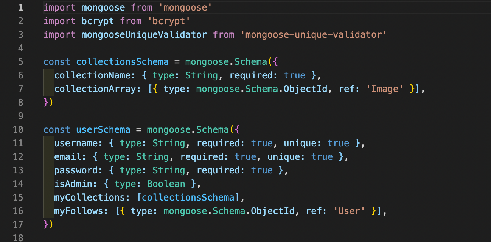
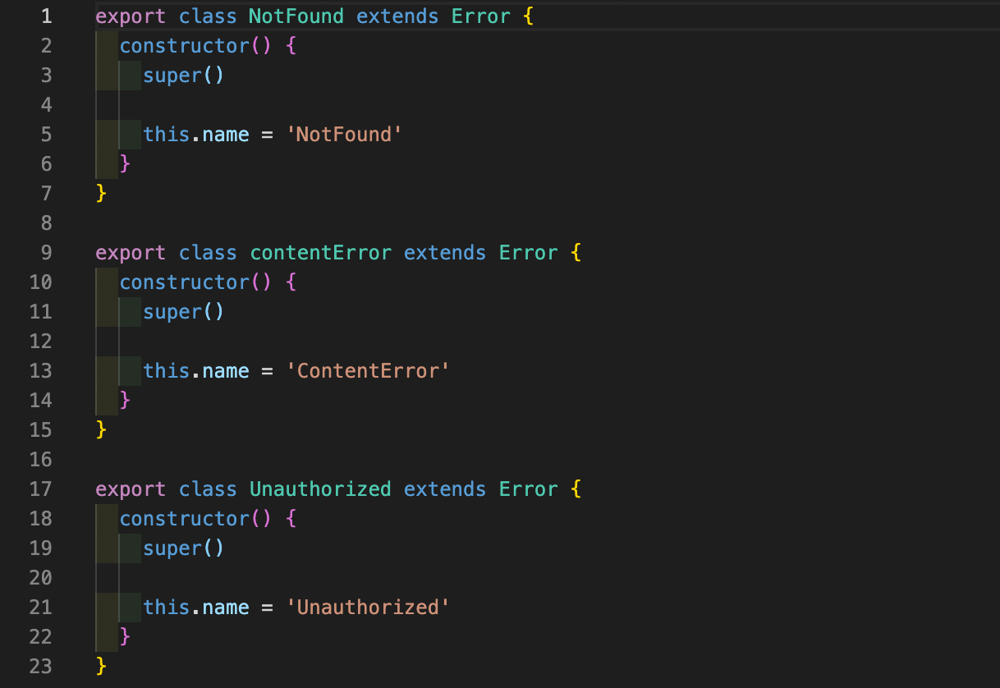
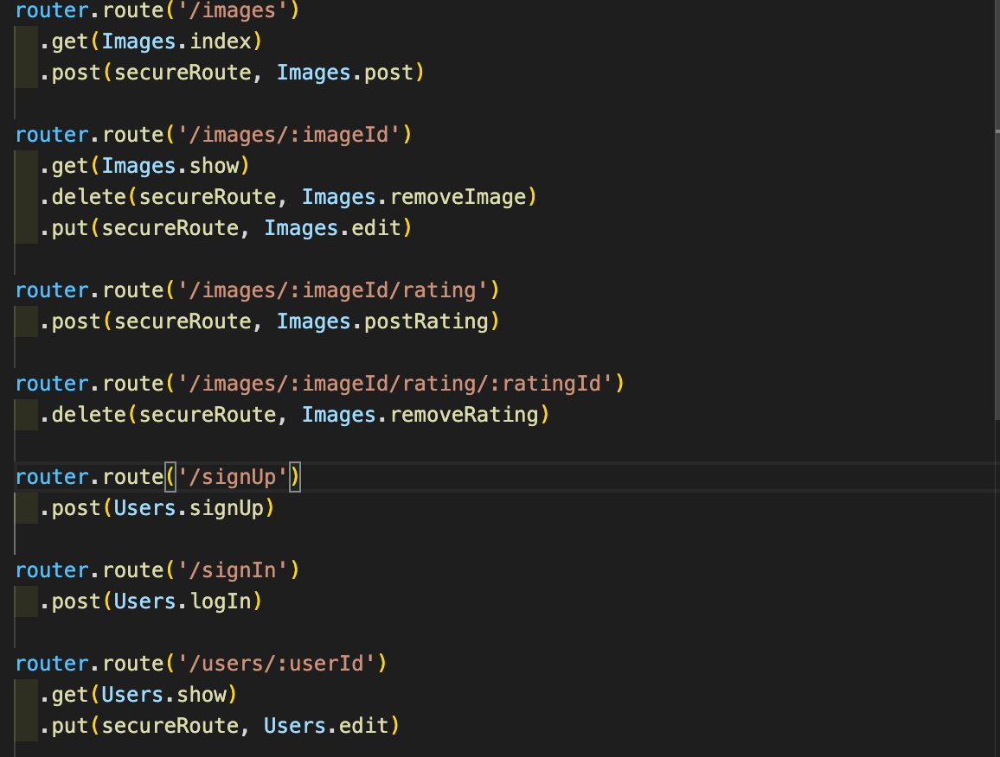
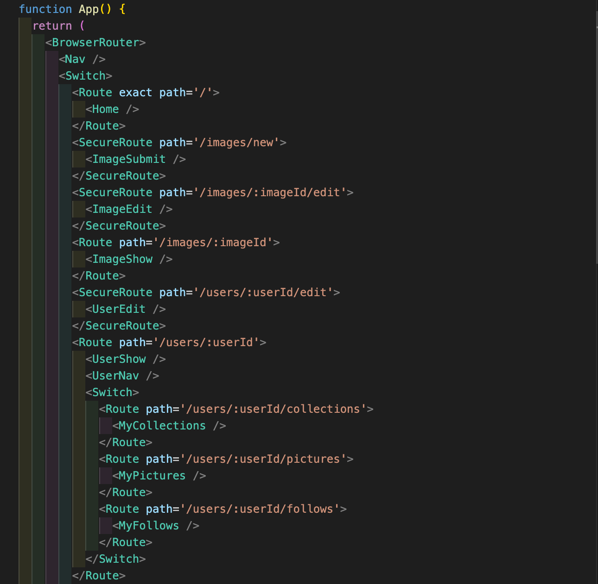
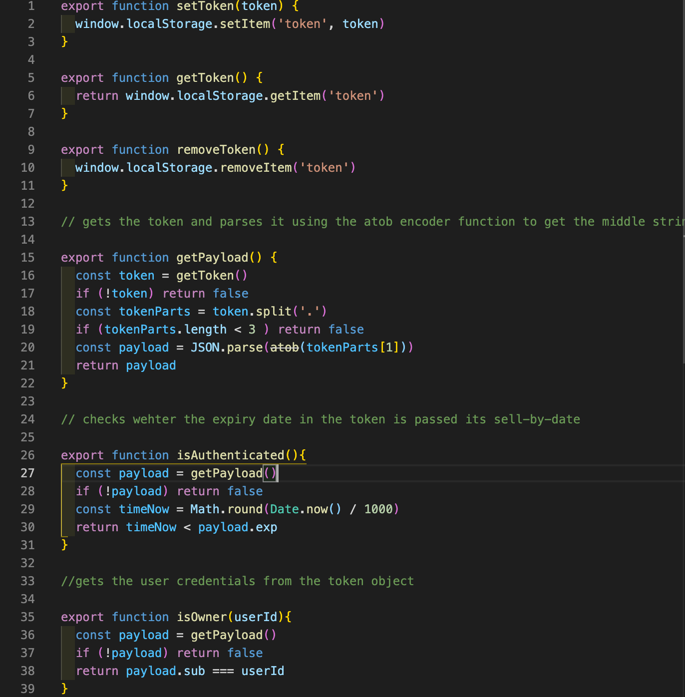
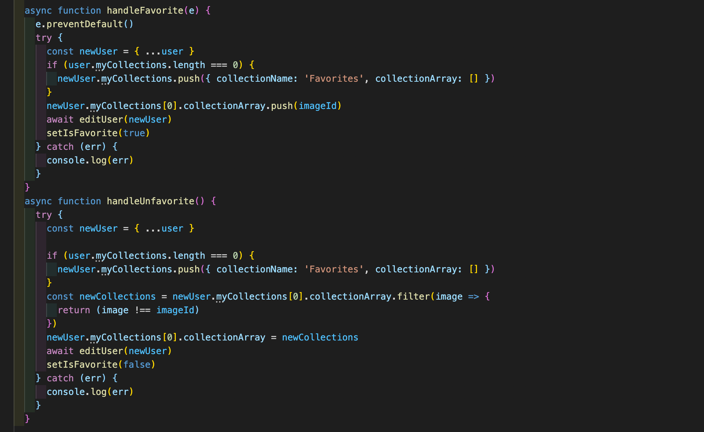
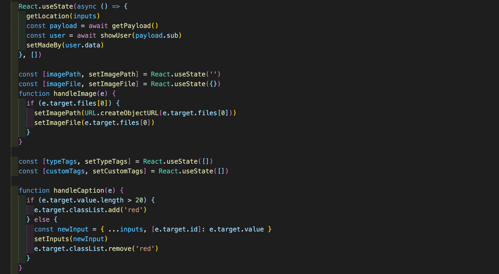

Project Three - Picturest

Overview: Picturest is a clone of a popular image sharing site. It utilises a MERN tech stack to achieve CRUD capabilities for user accounts and image instances. Picturest was a week long group project which emphasised the use of MapBox API as a main feature of the relationship between the image and where it was taken.

Getting Started:

To experience the site it is currently deployed with heroku at [https://picturest-photography-app.netlify.app/](https://picturest-photography-app.netlify.app/). Otherwise if you wish to edit and improve or simply play around with the code, simply fork it to your GitHub repository and run the server and client on your local machine. 

Brief:

The task was to create a web-app with a Django back-end to run the API. I was in a team of three people with one week to complete the project. To be able to demonstrate our capabilities in creating a CRUD capable app, we chose to create a user based service that allows photographers to upload their pictures with geotagging. This means other photographers could search for locations for their photography projects. 

The main features we wanted to include were user services such as signing up, editing their account, while also being able to follow other users and save their favourite pictures. The photos needed to be able to be tagged with relevant information such as what was in the photo and also the ability to include custom tags. This would allow us to filter images when users are searching for particular regions or photo types.

Technologies Used:

JavaScript

MongoDB

Express

Mongoose

Axios

React

MapBox(API)

Geocode(API)

Cloudinary(API)

Process:

BackEnd:

1. Firstly I created a Node file that would serve my express package. I then set up a function to show if the server was started and if the database has been loaded.
2. I then created a file to house the models that were required by the app. This was the user model and the image model. The user model required the standard set of inputs. By specifying the data-type and the requirement of the data, we created a way to create feedback to the user to show whether they had entered the correct information. I included a nested schema to hold multiple collections with an Id array to hold a series of liked images within the user instance. 

3. For the user profile, some password validation was required. As this information was being passed from the front end to the back end, Included a hashing middleware to securely encrypt the user information being sent to the backend.

        For the image model we included the data types of tags and rating. The tags data type allowed for the ability to assign relevant identifiers to the images such as location and descriptors of the image scene. I used a nested schema for the rating, which contained a ‘user’ reference so each rating as well as image, can be referred to by the front end. This allowed us to include delete permissions and specific user image submissions.

4. Following defining the data models, I created two request folders for the respective model instances. Both models required CRUD capabilities. I used async functions to create a modular approach, which would improve readability when building the router file.

  Each async function checked the current database if there should already be an instance of that file, such as logging back in or finding a particular image instance. Otherwise if it is the first creation of the instance such as signing up or submitting an image, then checked for the correct information being sent in the body. If there was missing information or a request to existing data was not matching (ie. password). A custom error would be returned via custom error functions.

5. As an extra layer of security, I created a secure route function to handle the password authentication and decryption. This secure route can be added to the routing components as middleware where a specific user permission is required. The payload of the request header was decrypted using the secret code then the sub component was looked-up in the database. If the user was not found then an unauthorized error was returned.
6. The router component was designed to handle the types of requests via the express.router() built-in function. By specifying the expected http request path with the .get/post/delete built in functions, the correct database information can be accessed and sent/edited/deleted.

FrontEnd:

1. For our React front-end, our first task was to construct a folder system to compartmentalise the relevant functions and page view components. We split the system into four main sections. The first being Images. This file contained the .js functions that provide the CRUD capability for the image models in the front end:
    1. The image card - this displays a simple submitted image view for a grid layout.
    2. The image-show card - this is what the user is redirected to after clicking on the image card. This would contain extra information such as a location map and tags as well as a description.
    3. Image submit - a form page for filling out the required information, as well as submitting an image file which we did via the cloudinary api which returned a url to be referenced by the database.
    4. Image edit - which provided a similar form to the image submit except with the ability to edit a currently existing instance of an image.
2. The second was Main. This housed the home page which would be the hub of the activity for the user. As well as this the Navigation which would provide user access.
3. The third was Users. This contained a series of functions which displayed information in regards to the users interaction with the site content. Login, Edit, Register, were the components created for handling account management. The userShow was created to display the other components referenced in the file such as the user follows, their image collections and their own image submissions. 

4. The last folder contained all of the functions required to deal with the database requests as well as the authentication functions and the variables for the built in tag options.

5. The App file contained the routing for each React Page. Using React Browser Router and the Route component tags, We were able to switch between each page instance by specifying the path of the page. To display each page, we sandwiched the imported components from the aforementioned folders between the route tags.The Switch tag was used for the user Show page to responsively switch between the follow, collection and submitted image cards, without changing pages.

6. To bridge the front-end to the back-end I used axios to create the request functions. For each action of the user and image models, I created an async function which used a get/post/put prefix. Then, depending on the access requirements such as the log-in function, I specified the http path and the body data along with the headers for authentication. I used string formatting to refer to the base url as well as the unique input data such as the imageid for reference by the backend routing.

7. To make these requests work as well as front end access, some require password verification as well as user identification. As a token was received via the log-in request, I created a function to set the token into local storage as well as another function to delete (upon logout) and get. The token was to be used to verify the user id via the sub component of the returned token. Therefore functions to return the relevant payload information were created. Through JSON.parse and the atob decoding functions, the function will return the token section which contains user id and expiry. Two follow up functions, isAuthenticated and isOwner then checked whether the token is still valid and whether the provided user is the one logged in respectively.

8. To construct the image elements we used a simple JSX construct combined with an onClick handle request to forward the user to the image page. The imageShow component used MapBox GL to render a map, using a useEffect function to async request the image information using the image id from the url path parameters. The location pin for the Map Box instance was entered using the lon and lat from the image get request. The other information, such as tags and the image owner, were populated in the JSX using string formatting which accessed the React.states update by the get request. To create the follow and unfollow function, a button was created which was linked to a handle click function. As the state of the follow button depended on the users current following status, a useEffect function was used to access the token payload and make a user request to ascertain whether the current image's owner was within the array of follows in the logged-in user. The follow button would either show follow or unfollow depending on this comparison. The follow function would then use the user edit function from the request library to either remove or push the image owner to the users following array.

9. The image submit was a form that was passed to a useState form through object spreading. The data in this form updates as the user types in the relevant JSX fields. For uploading the image a user can select a photo from their computer which is uploaded to Cloudinary image hosting platform. The image upload sends a request to the Cloudinary API which returns a url to access the image. As the map feature was a significant feature of the app, a function was devised to allow the user to either enter lon and lat or if they didn't have the exact data, they can use the mapbox map pin and place it on a point on the map. Whether it is entered manually or using the map, the location is then updated to the lon and lat state. When all the information is entered correctly, a function axios request posts the image with the populated information.

10. Designing the image edit page was much alike the image submit except it makes a call to image id and populates the form with pre-existing data. The data could then be easily changed using the same object spreading and useState method. We used a submit button to make a final API request to alter the original information via a put request. As this was a creator only service, the component in App was wrapped with a secure route tag. The secure route acts as a middleware between the request and displaying the page. It checked the token using the isAuth to make sure the user had valid access. Although if the user was not authorised as it was not their upload then the edit button on the image show page would not appear using a ternary operator.

Known Errors/Bugs:

The main Bug is in regards to how the user profile page displays the users that are being followed. In most cases the list is fully populated, but sometimes the list is a user short. We decided this was to do with how the function calls the backend for this information. As it is a batch axios request we assumed the list was populated before all the responses had been collected. To avoid this, a function was included to check the length of the list and if it is not what the length of the list was previously then the process should run again until it is.

Challenges:

One of the main challenges was adjusting the BackEnd to meet the needs of the FrontEnd. As we developed our FrontEnd capabilities we realised that some of our BackEnd structure wasn’t suitable for our FrontEnd requests. This meant that we had to carefully assess our other function to determine whether the changes we needed to make would affect the functionality. 

Wins:

Being able to meet our MVP, which was to involve all the features you would expect from a similar app, was our main success. This was a testament to our vision and our planning. Although we had to make changes on the fly, we were able to devise a clear communication and naming structure to discuss possible issues and resolve them quickly. 

Future Improvements:

Although the app has a high degree of functionality, I feel more emphasis on the aesthetic look of the web app would increase its credibility as a fully fledged web app. The first step would be to evaluate the styles for key components and create a cohesive naming system to apply consistent themes. Then applying these along with a logo that represents the product image, would greatly increase its marketability.

Currently the preset for pictures is a portrait view which it retains even in viewing. Following on from the above suggestion, being able to upload images of various sizes and orientations that will be well served by grid and individual views, will make for a more well rounded app. This can be done by implementing a ‘tetris’ style grid so different images can be viewed correctly. As well as this, adding in additional information from meta-data such as camera type and lens as well as creating a minimum resolution would restrict uploads to only high-definition images. 

KeyLearnings:

The key learning came from the backend. Express was a new technology and understanding the implementation and behaviour of middle-ware became a key element to the learning experience. Being able to implement a password hashing and authorization element required a deep understanding of the data pipeline and data manipulation to create a functioning app. Much of this learning came in the form of reading documentation and breaking apart the key components, to construct the middleware that would not respond with unauthorized errors. Testing via Insomnia really helped in testing the headers and token system.